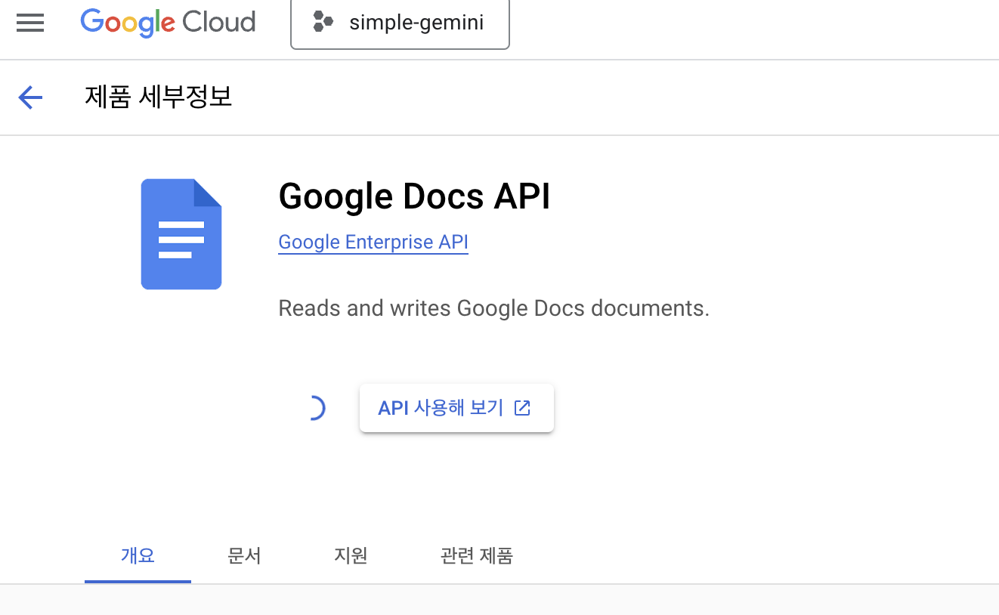
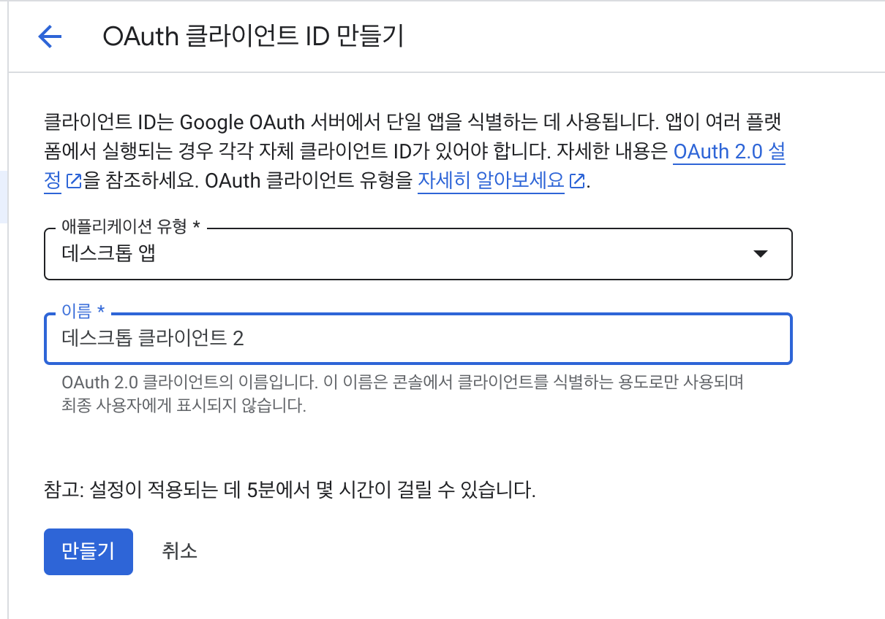

Google Docs MCP 인증 설정 방법
===========================

1. Google Cloud Console에 접속: https://console.cloud.google.com/

2. 새 프로젝트 생성
   - 우측 상단의 프로젝트 선택기 → '새 프로젝트'
   - 프로젝트 이름 입력 (예: "Google Docs MCP")
   - '만들기' 클릭

3. API 라이브러리 활성화
   - 왼쪽 사이드바에서 'API 및 서비스' → 'API 라이브러리' 선택
   - "Google Docs API" 및 "Google Drive API" 검색하여 각각 활성화
   
   

4. OAuth 동의 화면 설정
   - 왼쪽 사이드바에서 'API 및 서비스' → 'OAuth 동의 화면' 선택
   - 사용자 유형(일반적으로 '외부') 선택하고 '만들기' 클릭
   - 필수 정보 입력 (앱 이름, 사용자 지원 이메일 등)
   - 데이터 액세스 -> 범위 추가: 
     * https://www.googleapis.com/auth/documents
     * https://www.googleapis.com/auth/drive
   - '저장 후 계속' 클릭하여 나머지 단계 완료

5. 사용자 인증 정보 생성
   - 왼쪽 사이드바에서 'API 및 서비스' → '사용자 인증 정보' 선택
   - '+ 사용자 인증 정보 만들기' → 'OAuth 클라이언트 ID' 선택
   - 애플리케이션 유형: 'Desktop app' 선택
   - 이름 입력 (예: "Google Docs MCP Desktop")
   - '만들기' 클릭
   - JSON 다운로드 버튼 클릭
   

6. 인증 파일 적용
   - 다운로드된 JSON 파일의 이름을 'credentials.json'으로 변경
   - 이 파일을 프로젝트 루트 디렉토리에 이동
   
7. 필수 패키지 설치
   - 터미널에서 프로젝트 디렉토리로 이동
   - `npm install googleapis google-auth-library` 실행
  
8. 서비스 초기화 및 인증
   - `npm run build` 실행하여 코드 빌드
   - `npm run start` 실행하여 서비스 시작
   - 콘솔에 출력된 인증 URL을 확인:
      예:
     ```
     인증 URL로 이동하여 인증을 진행해주세요:
     https://accounts.google.com/o/oauth2/v2/auth?access_type=offline&scope=https%3A%2F%2Fwww.googleapis.com%2Fauth%2Fdocuments%20https%3A%2F%2Fwww.googleapis.com%2Fauth%2Fdrive%20https%3A%2F%2Fwww.googleapis.com%2Fauth%2Fdrive.file&response_type=code&client_id=[YOUR_CLIENT_ID]&redirect_uri=http%3A%2F%2Flocalhost
     ```

9. 인증 코드 획득
   - 브라우저에서 인증 URL을 열기
   - Google 계정으로 로그인하고 권한 부여
   - 리디렉션된 URL(`http://localhost/?code=4/...`)에서 `code=` 뒤의 값이 인증 코드
   - 인증 코드를 복사

10. 인증 코드 적용
    - 서비스 중지 후 인증 스크립트 실행:
    - `node build/auth-script.js [인증_코드]` 명령 실행
    - 성공 메시지 확인:
      ```
      인증이 성공적으로 완료되었습니다!
      토큰이 저장되었습니다: /Users/[사용자명]/Documents/google-docs-mcp/token.json
      ```

11. 문서 읽기 테스트
    - 문서 ID를 확인 (Google Docs URL에서 `/d/` 뒤, 다음 `/` 전까지의 값)
    - 다음 명령으로 문서 읽기:
    - `node build/read-document.js [문서_ID]`
    - 문서 제목과 내용이 출력됨

참고: 
- 인증 토큰은 `token.json` 파일에 저장되며, 이후 실행 시 자동으로 사용됩니다.
- 테스트 계정으로만 OAuth 동의 화면이 설정된 경우, 테스트 사용자로 추가된 계정만 인증할 수 있습니다.
- 토큰이 만료되면 인증 과정(8-10단계)을 다시 수행해야 합니다. 